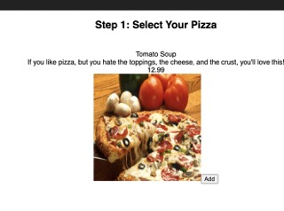

   
# Pizza-Parlor-Group-Project

## Description

This is an application that mimics ordering a pizza from your local pizza place. It allows users to select which pizza they would like. When they select one it will update there cart to reflect the price of the pizza they clicked on. From there the customer can enter information and if they'd like to do carry out or delivery. Finally they will arrive to a review page that lets them see all the information

## Screenshots

## Built With

### Installation

npm install
npm run server
npm run client

## Contacts

  